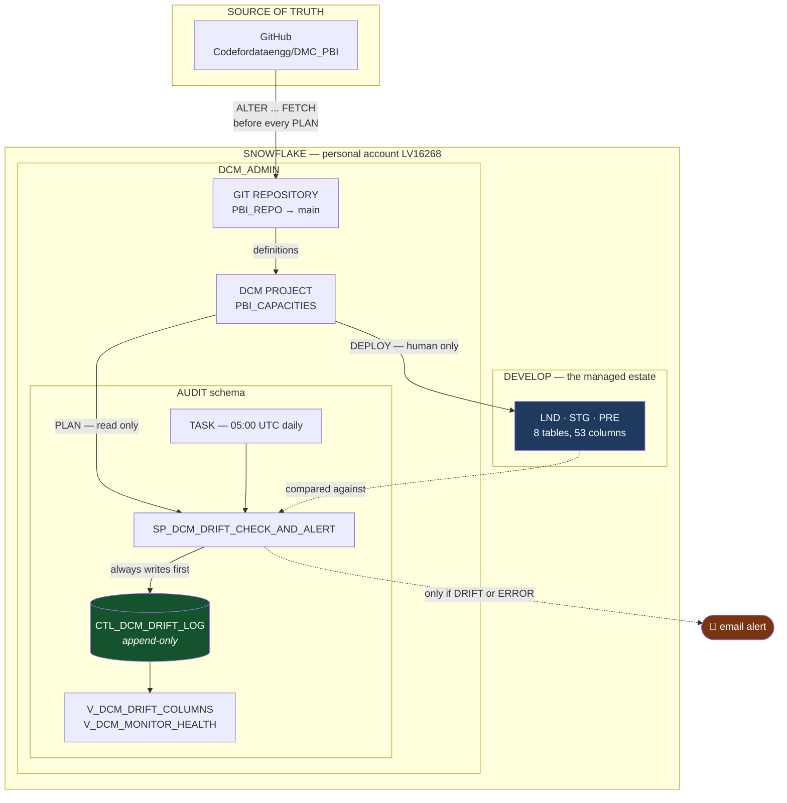
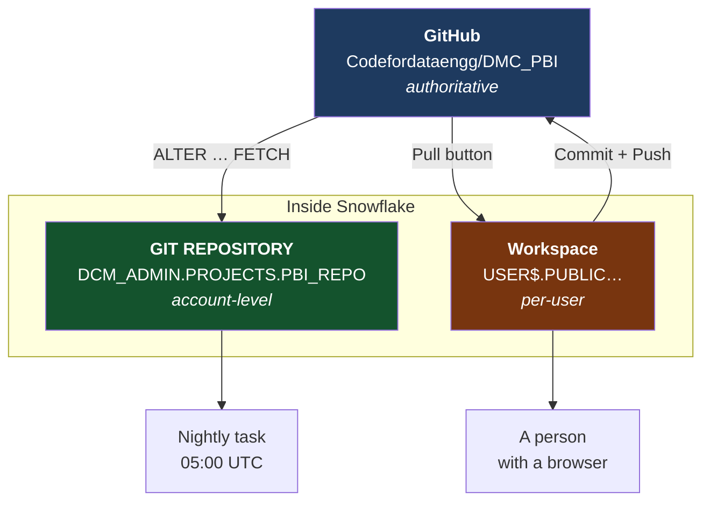
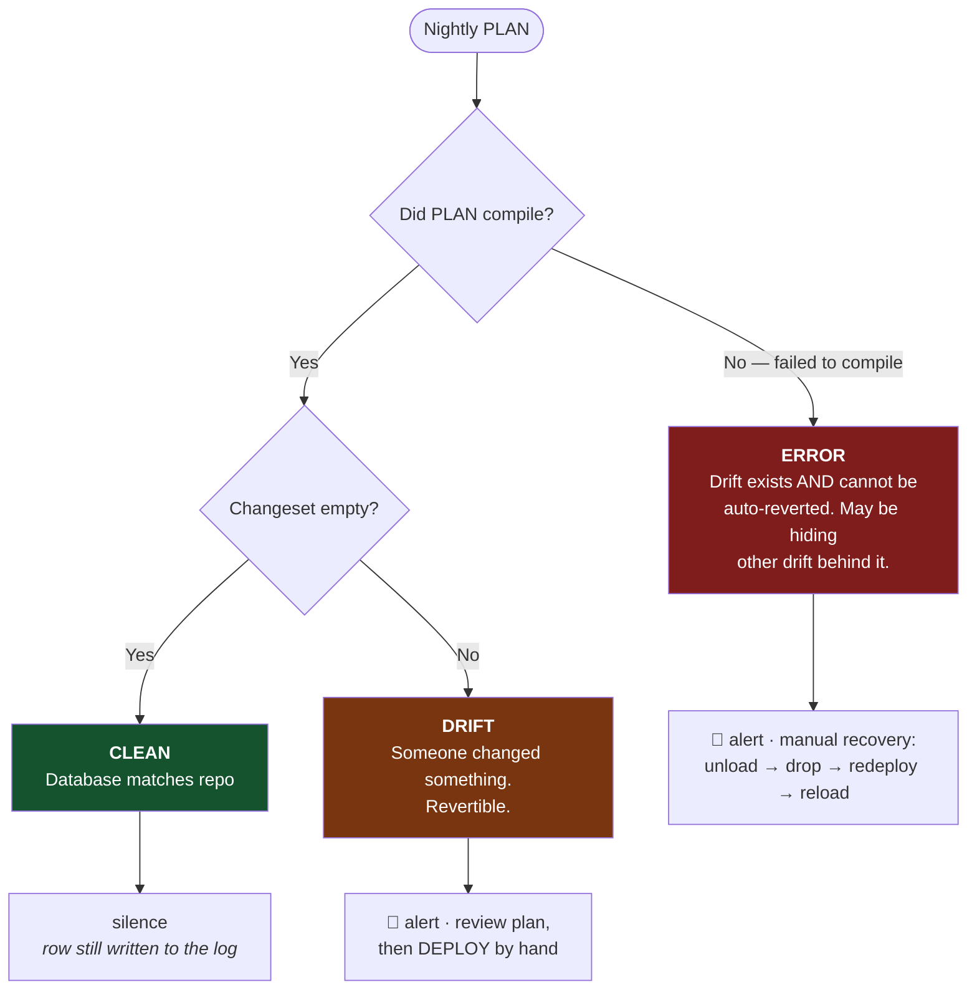
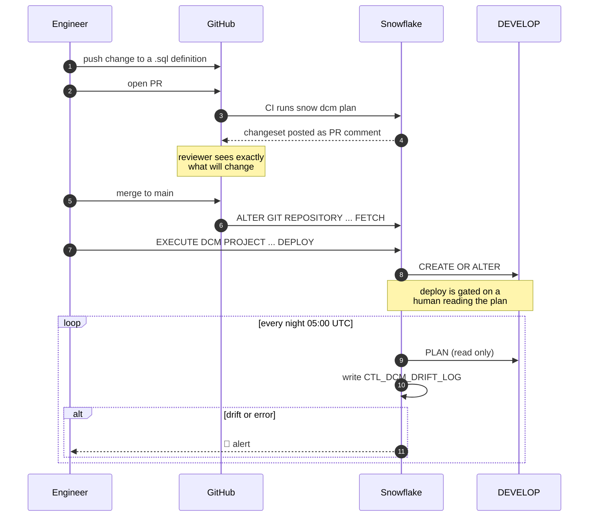

# DCM Architecture — how schema drift gets caught

**Status: POC proven end-to-end in account `LV16268`, 2026-08-23.**
Nothing here touches `DEVELOP` at Snowy or any Matillion pipeline.

---

## 1. The problem in one picture

The pipelines create tables with `CREATE TABLE IF NOT EXISTS` — 70 of them across 8 pipeline files. Against a table that already
exists, that statement **does nothing at all** — it does not inspect the table, and it cannot.

```mermaid
flowchart LR
    subgraph today["TODAY — CREATE TABLE IF NOT EXISTS"]
        direction TB
        A1[Pipeline runs] --> A2{Table exists?}
        A2 -->|No| A3[Create it ✅]
        A2 -->|Yes| A4["Do nothing<br/>never looks inside"]
        A4 --> A5["Someone added a column<br/>by hand in March"]
        A5 --> A6["Pipeline still green<br/>every night, forever"]V
    end
    style A4 fill:#7f1d1d,color:#fff
    style A6 fill:#7f1d1d,color:#fff
```

Two different guarantees, and only the first is real today:

| | Statement | Today | With DCM |
|---|---|---|---|
| 1 | "This repo can build the database" | ✅ | ✅ |
| 2 | "The database matches this repo" | ❌ | ✅ |

Closing (2) is the whole point. Everything below exists to serve it.

---

## 2. What was built



**The one asymmetry that matters:** `PLAN` is automated, `DEPLOY` is not. `PLAN` only reads.
`DEPLOY` reverts drift by dropping columns and destroying their data ([F3](../FINDINGS.md)).

---

## 3. Three copies of the same files

**The most common misunderstanding in this design.** The definitions exist in three places at
once. All three can be stale, independently, and nothing warns you.



| | Lives in | Updated by | Read by | Survives you leaving |
|---|---|---|---|---|
| **GitHub repo** | github.com | your push | everyone | yes |
| **`GIT REPOSITORY`** | `DCM_ADMIN.PROJECTS` | `ALTER … FETCH` | `PLAN`, `DEPLOY`, the task | yes |
| **Workspace** | your `USER$` database | **Pull** button | you, in the editor | **no** |

### Three consequences that actually bite

**1. A `GIT REPOSITORY` is a snapshot, not a live link.** Push a commit and it knows nothing
until someone runs `FETCH`. This is why `SP_DCM_DRIFT_CHECK_FROM_GIT` fetches *before* planning
— otherwise the nightly check compares the database against last week's repo and reports the
difference as drift.

**2. The workspace and the repository object are siblings, not parent and child.** Pushing from
the workspace does not update `PBI_REPO`. Fetching `PBI_REPO` does not update the workspace.
Update one and the other is silently behind.

**3. A workspace is invisible to automation.** One statement proves it:

```sql
SHOW GIT REPOSITORIES IN ACCOUNT;      -- a git-connected workspace is NOT listed
```

It lives in a per-user database, and a scheduled task has no user session. This is why creating
a workspace *From Git repository* does **not** remove the need for `CREATE GIT REPOSITORY` —
and why that step has no UI path at all.

### Which one is authoritative

**GitHub.** The other two are caches. When they disagree, git wins, and the fix is always to
sync the copy — never to edit it in place.

---

## 4. The three verdicts

A two-state monitor — "changeset empty or not" — is **wrong for the majority of real
incidents**. [F7](../FINDINGS.md) proved why.



### Which hand-made changes land where

| What someone does by hand | Revertible? | Verdict | Why |
|---|---|---|---|
| Adds a column | ✅ | `DRIFT` | Drop is supported |
| Drops the **last** column | ✅ | `DRIFT` | Re-append restores it |
| **Drops any other column** | ❌ | **`ERROR`** | Restoring it mid-list is a reorder — unsupported |
| Widens a `VARCHAR` | ❌ | **`ERROR`** | Narrowing is unsupported |
| Renames a column | ❌ | **`ERROR`** | Reads as drop + add, so position moves |
| Changes nullability / default / comment | ✅ | `DRIFT` | Supported by `ALTER` |

> **45 of the 53 columns in this slice are not the last column in their table.** So most
> accidental drops produce `ERROR`, not `DRIFT`. `ERROR` is the common path, not the edge case.

---

## 5. Why an audit table exists at all

DCM stores an immutable artifact snapshot for every **deployment** and calls it the canonical
audit trail. It is — for deployments. [F6](../FINDINGS.md) measured what happens to plans:

```
7+ PLAN operations executed · 4 DEPLOY operations executed

SELECT PHASE, COUNT(*) FROM DCM_DEPLOYMENT_HISTORY(...)
   PHASE   N
   DEPLOY  4      ← no PLAN rows. none.
```

**The drift check is the one operation Snowflake does not remember.** A nightly PLAN would
find the hand-added column, print it to a task log, and lose it.

| Gap | Native | With `CTL_DCM_DRIFT_LOG` |
|---|---|---|
| Plans recorded | ❌ never | ✅ every one |
| Retention | 12 months | unlimited |
| `ACCOUNT_USAGE` view | ❌ none exists | n/a — it's your table |
| "When did this drift start?" | unanswerable | ✅ |

That last question is the one the dashboard-freeze incident turned on.

---

## 6. Failure modes designed for

Each row is a way the monitor could quietly stop being a monitor.

| Failure | What would happen without design | What happens now |
|---|---|---|
| Stale git clone | Compares the database to an old repo and calls it clean | `FETCH` runs inside the check, before every `PLAN` |
| "Latest row" found by `IDENTITY` | Alert reads an older row and stays silent (F8) | Sequence claimed before insert; recency from timestamps |
| Monitor permanently amber | People stop reading it | `ACKNOWLEDGED_AT` closes a finding without faking a notification |
| Someone uses `PLAN DELTA` | Skips out-of-band changes → reports `CLEAN` over a drifted database | Comment in the proc; CLI has no delta flag |
| Email outage | Finding lost | Audit row written **first**; `NOTIFIED=FALSE` surfaces in health view |
| Task suspended | Silence reads identical to "all clear" | `V_DCM_MONITOR_HEALTH` → `STALE` / `NEVER_RUN` |
| Un-revertible drift | Read as a broken job | Distinct `ERROR` verdict, most severe |
| Nightly "all good" mail | Sender gets filtered, real alert filtered too | Silent on `CLEAN` |
| Alert reads backwards | Plan says "removed" for a column a human *added* | `WHAT_A_HUMAN_DID` translates once, in the view |

---

## 7. Deployment flow, once git is wired



---

## 8. Files

| File | Purpose |
|---|---|
| [`../01_CAPTURE_TARGET_STATE.sql`](../01_CAPTURE_TARGET_STATE.sql) | Read-only `GET_DDL` — run in real `DEVELOP` |
| [`../target-state/GET_DDL_2026-08-22.txt`](../target-state/) | The capture, verbatim. **Evidence — never edit** |
| [`../02_VERIFY_DCM_AVAILABLE.sql`](../02_VERIFY_DCM_AVAILABLE.sql) | Availability gate ✅ passed |
| [`../manifest.yml`](../manifest.yml) | `manifest_version: 2`, target `YVTSYHL-PP80681` |
| [`../sources/definitions/`](../sources/definitions/) | The declared state — 12 entities |
| [`../03_RUN_ACCEPTANCE_TEST.md`](../03_RUN_ACCEPTANCE_TEST.md) | Five steps via CLI |
| [`../04_SNOWSIGHT_RUN.sql`](../04_SNOWSIGHT_RUN.sql) | ~~Same five steps as pure SQL~~ **superseded** — stage-based, stage dropped |
| [`../10_AUDIT_AND_MONITOR.sql`](../10_AUDIT_AND_MONITOR.sql) | Log, views, drift procedure, task |
| [`../11_ALERTING.sql`](../11_ALERTING.sql) | Email integration, alert body, health view |
| [`../12_GIT_INTEGRATION.sql`](../12_GIT_INTEGRATION.sql) | Secret, API integration, git clone, git-sourced task |
| [`../90_INDUCE_DRIFT.sql`](../90_INDUCE_DRIFT.sql) | Deliberate drift for testing |
| [`../FINDINGS.md`](../FINDINGS.md) | **F1–F13.** Dated, evidenced results |
| [`../DEMO_RUNSHEET.md`](../DEMO_RUNSHEET.md) | Live demo script — DCM and git, the full round trip |

---

## 9. Findings index

| | Finding | Impact |
|---|---|---|
| F1 | Repo and database agree for the capacities slice — zero drift across 53 columns | Closed an open concern |
| F2 | `PLAN DELTA` cannot see out-of-band changes | Would have produced a false negative |
| F3 | Reverting drift means `DROP COLUMN`; data is lost | `DEPLOY` never scheduled |
| F4 | One un-revertible drift aborts the whole `PLAN` | Third verdict required |
| F5 | **DCM detects hand-made drift, naming the column and type** | The POC verdict — pass |
| F6 | **DCM records `DEPLOY`, never `PLAN`** | The audit table is mandatory |
| F7 | Dropping a non-last column is un-revertible | `ERROR` is the common case |
| F8 | Snowflake `IDENTITY` is not monotonic across sessions | Silently suppressed a `DRIFT` alert |
| F9 | The monitor never ran and the health view reported `OK` | Task state is now a health input |
| F10 | Views work, report the SQL diff, share the reorder limit | Views are safer only in that reverting one loses no data |
| F11 | Ran unattended two consecutive nights, ~30s per run | The schedule is proven, not asserted |
| F12 | `IF NOT EXISTS` says "already exists, statement succeeded" | It is honest; the defect is that doing nothing reads as success |
| F13 | The count was 70, not 64; the dashboard freeze was a different defect | Audit every quoted figure, including our own |

---

## 10. Honest limits

- One slice: 8 tables, 53 columns, **no data**. Behaviour at 64 tables is untested.
- Tables, schemas and databases only. Views, tasks, streams and grants unproven.
- DCM Projects is a **preview** feature (announced 2026-03-20).
- Runs in a personal account. `SNOWUTILS_RO`/`SNOWUTILS_ADMIN` grants were dropped, so the
  grant layer is entirely untested.
- **Live as of 2026-08-25:** git is the only source (the stage is dropped) and the nightly task
  has run unattended on two consecutive nights, ~30s each, both `CLEAN` (F11). Still unproven:
  a scheduled run finding real drift and emailing without anyone present.
- The `ERROR` recovery path has been exercised only on empty tables. On a table holding data
  it means unload → drop → redeploy → reload, and that has not been rehearsed.
